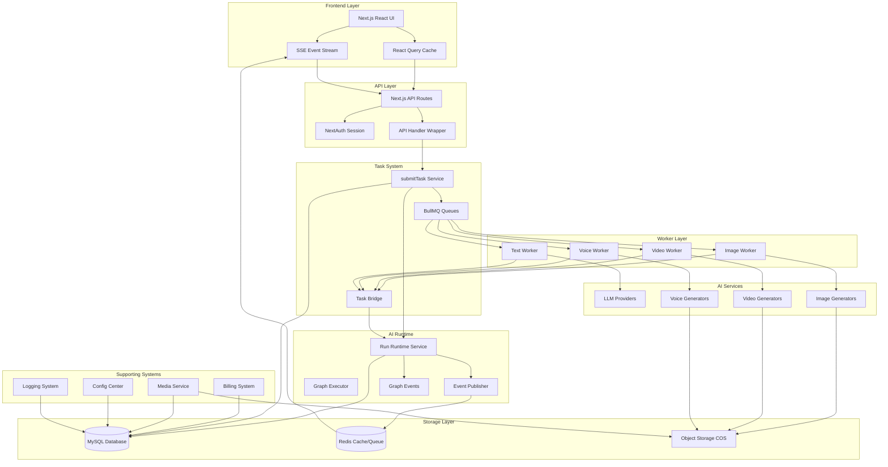
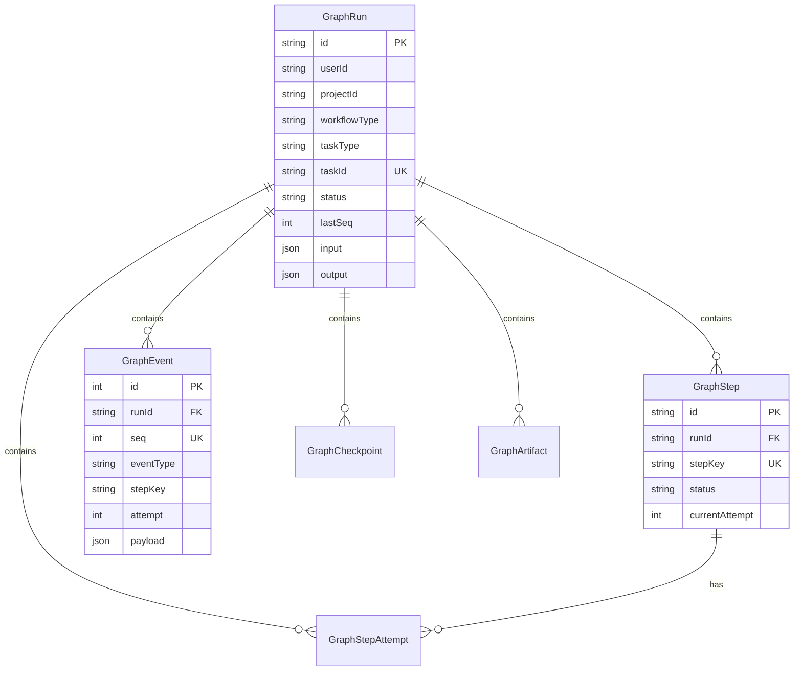
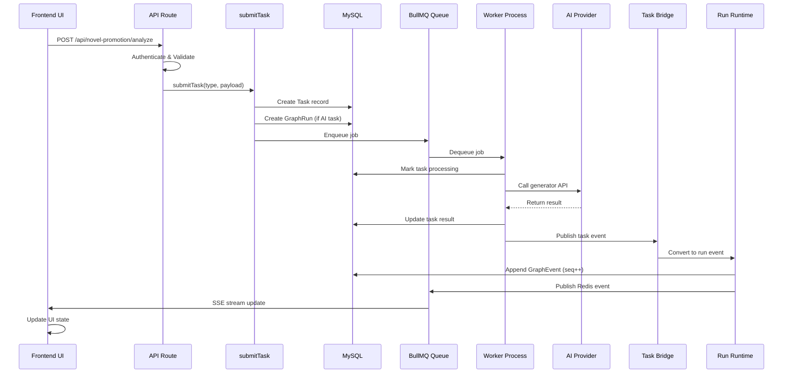
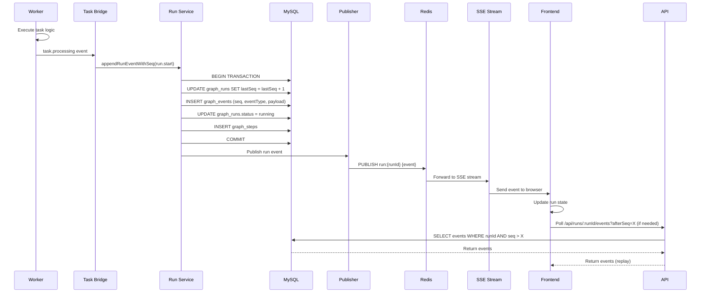
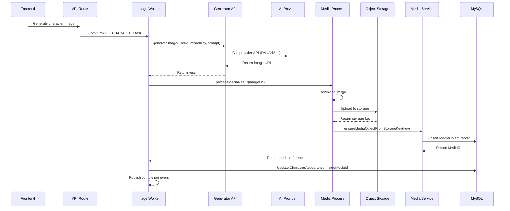
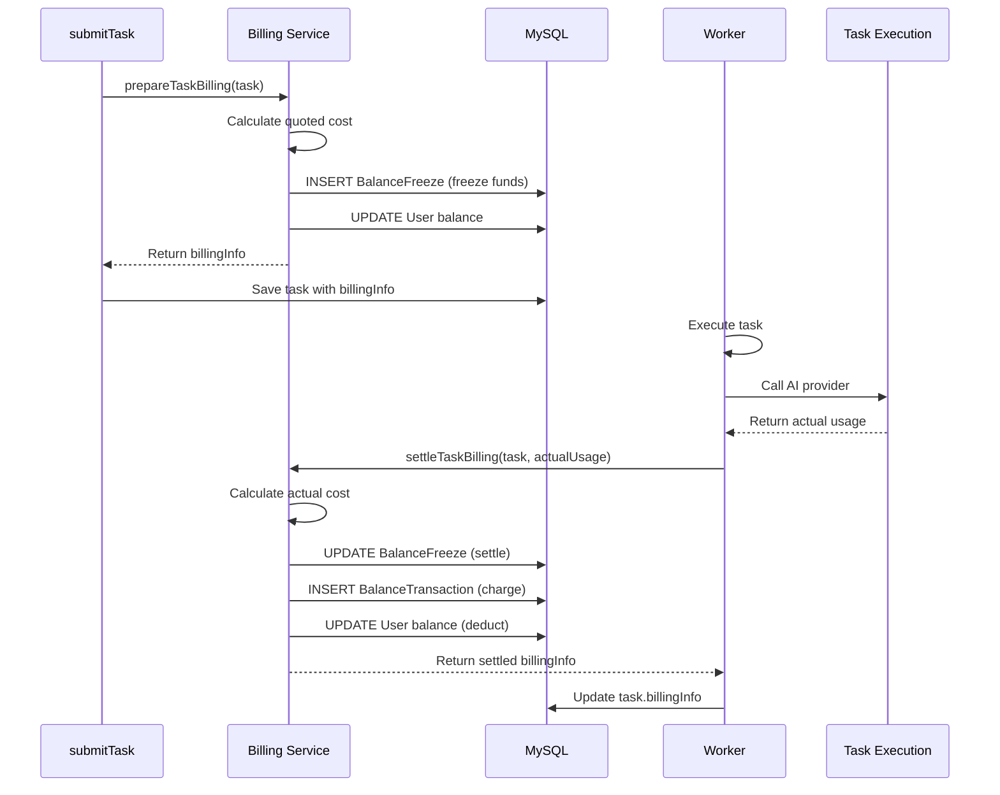
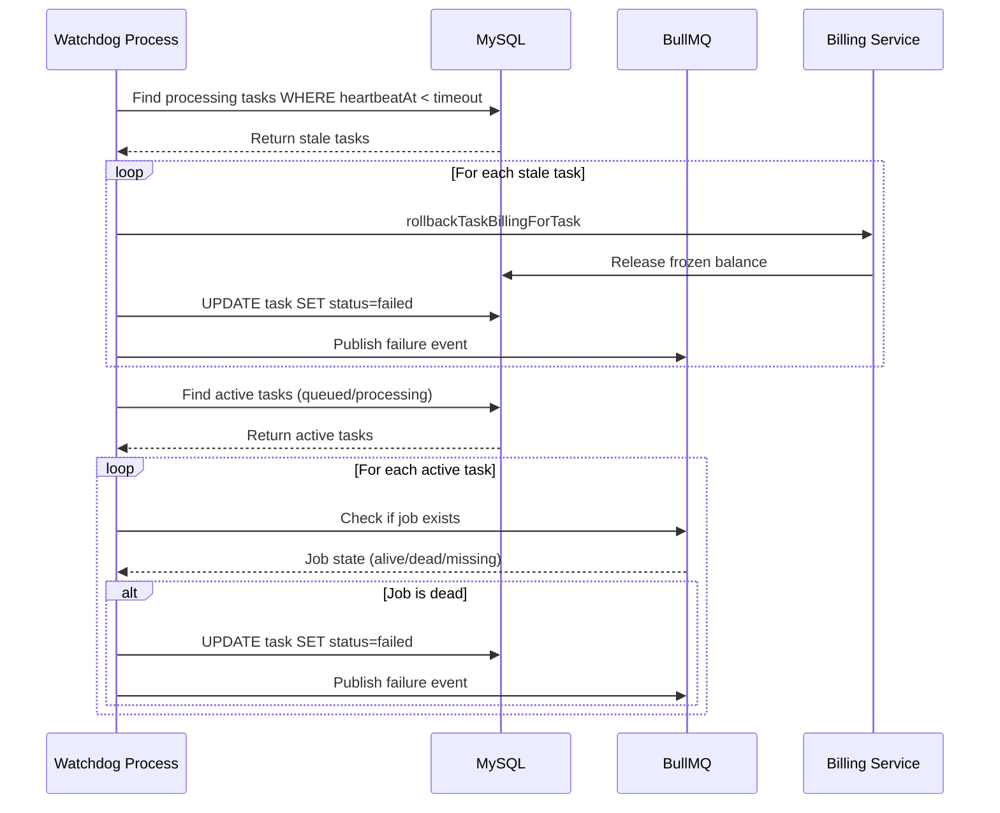
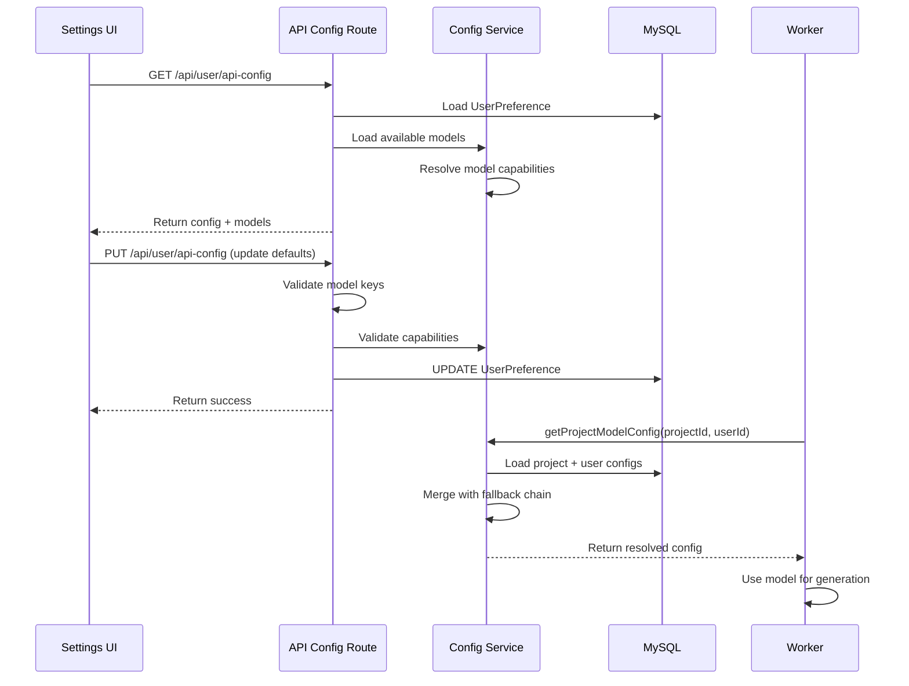

# waoowaoo Repository Architecture Explained

## Table of Contents
1. [System Overview](#system-overview)
2. [High-Level Architecture](#high-level-architecture)
3. [Core Components](#core-components)
4. [Data Flow Diagrams](#data-flow-diagrams)
5. [Detailed Component Explanations](#detailed-component-explanations)
6. [Technology Stack](#technology-stack)
7. [Key Workflows](#key-workflows)

---

## System Overview

**waoowaoo** is an AI-powered video production platform that transforms novel text into complete video productions. The system automatically:
- Analyzes novels to extract characters, scenes, and plot
- Generates consistent character and location images using AI
- Creates storyboard panels and video shots
- Synthesizes multi-character voiceovers
- Composes final videos with synchronized audio

The platform is built as a **Next.js 15** application with a **microservices-inspired architecture** using:
- **Next.js** for the web frontend and API routes
- **BullMQ + Redis** for distributed task queues
- **MySQL + Prisma** as the single source of truth
- **Worker processes** for async task execution
- **Unified AI Runtime** for consistent task state management

---

## High-Level Architecture



---

## Core Components

### 1. Frontend Layer (`src/app/[locale]/`)

**Purpose**: User interface built with Next.js App Router and React 19.

**Key Components**:
- **Workspace Provider** (`WorkspaceProvider.tsx`): Manages project/episode context and task event subscriptions
- **SSE Hook** (`useSSE.ts`): Connects to `/api/sse` for real-time task updates
- **Run Stream Hook** (`useRunStreamState.ts`): Manages AI runtime state with recovery and replay
- **React Query**: Client-side data caching and synchronization

**How It Works**:
- Users interact with UI components (character creation, storyboard editing, etc.)
- Actions trigger API calls via React Query mutations
- SSE stream provides real-time updates for task progress
- Run stream hook manages complex AI workflow state with automatic recovery

---

### 2. API Layer (`src/app/api/`)

**Purpose**: Next.js API routes handle HTTP requests with authentication and validation.

**Key Patterns**:
- **API Handler Wrapper** (`apiHandler`): Centralized error handling, logging, and response formatting
- **Authentication** (`requireAuth`, `requireProjectAuth`): Session verification and project ownership checks
- **LLM Observe** (`llm-observe/route-task.ts`): Automatically converts LLM API calls to async tasks when needed

**Route Categories**:
- `/api/projects/*`: Project and episode CRUD operations
- `/api/asset-hub/*`: Global asset management (characters, locations)
- `/api/novel-promotion/*`: Novel-specific operations (analysis, screenplay conversion)
- `/api/tasks/*`: Task status queries
- `/api/runs/*`: AI runtime run management
- `/api/sse`: Server-Sent Events for real-time updates

**How It Works**:
1. Request arrives → `apiHandler` wraps execution
2. Authentication middleware verifies session
3. Business logic executes (may call `submitTask`)
4. Response formatted with proper error codes
5. Logging captures all operations

---

### 3. Task System (`src/lib/task/`)

**Purpose**: Unified task submission, queuing, and lifecycle management.

**Key Components**:

#### `submitTask` (`submitter.ts`)
- **What**: Creates tasks and optionally AI runtime runs
- **How**: 
  - Normalizes payload based on task type
  - Computes billing information
  - Creates database record
  - Enqueues to appropriate BullMQ queue
  - For AI tasks, creates `GraphRun` record
- **Why**: Single entry point ensures consistent task creation with deduplication, billing, and run tracking

#### Task Queues (`queues.ts`)
- **Queues**: `IMAGE`, `VIDEO`, `VOICE`, `TEXT` (BullMQ)
- **Configuration**: Concurrency limits, retry policies, job options
- **Why**: Separates task types for independent scaling and priority management

#### Task Service (`service.ts`)
- **What**: Database operations for tasks
- **Functions**: `createTask`, `markTaskProcessing`, `updateTaskResult`
- **Why**: Centralized task state management with proper transaction handling

#### Task Publisher (`publisher.ts`)
- **What**: Publishes task lifecycle and stream events to Redis
- **Events**: `created`, `processing`, `progress`, `completed`, `failed`, `stream`
- **Why**: Enables real-time UI updates via SSE

**Task Lifecycle**:
```
queued → processing → completed/failed
         ↓
    heartbeat updates
         ↓
    progress events
         ↓
    stream chunks (for LLM)
```

---

### 4. Worker Layer (`src/lib/workers/`)

**Purpose**: Execute tasks asynchronously with proper error handling, billing, and event publishing.

**Worker Types**:

#### Image Worker (`image.worker.ts`)
- **Handles**: Character images, location images, panel images, asset hub images
- **Concurrency**: 50 (configurable via `QUEUE_CONCURRENCY_IMAGE`)
- **Process**: 
  1. Receives job from BullMQ
  2. Calls `withTaskLifecycle` wrapper
  3. Routes to appropriate handler (character, location, panel, etc.)
  4. Generates image via generator API
  5. Uploads to object storage
  6. Updates database records
  7. Publishes completion event

#### Video Worker (`video.worker.ts`)
- **Handles**: Video panel generation, storyboard video composition
- **Concurrency**: 50 (configurable)
- **Process**: Similar to image worker but generates videos from images

#### Voice Worker (`voice.worker.ts`)
- **Handles**: Voice line synthesis, voice design
- **Concurrency**: 20 (configurable)
- **Process**: Calls voice generation APIs, processes audio files

#### Text Worker (`text.worker.ts`)
- **Handles**: Novel analysis, screenplay conversion, LLM proxy tasks
- **Concurrency**: 50 (configurable)
- **Process**: Routes to LLM handlers or proxy tasks

**Shared Worker Infrastructure** (`shared.ts`):

#### `withTaskLifecycle`
- **What**: Wraps worker execution with standardized lifecycle management
- **Features**:
  - Heartbeat monitoring (prevents zombie tasks)
  - Billing preparation and settlement
  - Progress reporting
  - Error handling with retry logic
  - Task event publishing
- **Why**: Ensures all workers follow consistent patterns for reliability

**Worker Startup** (`index.ts`):
- Creates all four workers
- Registers event handlers (ready, error, failed)
- Handles graceful shutdown

---

### 5. AI Runtime System (`src/lib/run-runtime/`)

**Purpose**: Unified runtime semantics for all AI tasks with state management, event ordering, and recovery.

**Key Concepts**:
- **Run**: A single AI workflow execution (e.g., "analyze novel", "convert screenplay")
- **Step**: A stage within a run (e.g., "extract characters", "generate images")
- **Attempt**: A retry of a step (steps can retry, runs cannot)
- **Event**: Immutable log entry with sequence number (`seq`)

**Core Components**:

#### Run Service (`service.ts`)
- **`createRun`**: Creates a new `GraphRun` record
- **`appendRunEventWithSeq`**: Atomically increments `lastSeq`, writes event, updates projections
- **`getRunSnapshot`**: Retrieves current run state
- **`listEventsAfterSeq`**: Fetches events for replay/recovery
- **Why**: Single source of truth in MySQL with transactional consistency

#### Task Bridge (`task-bridge.ts`)
- **What**: Converts task events to run events
- **Mapping**:
  - `task.created` → `run.start`
  - `task.processing` → `step.start`
  - `task.stream` → `step.chunk`
  - `task.completed` → `step.complete` → `run.complete`
  - `task.failed` → `step.error` → `run.error`
- **Why**: Bridges legacy task system with new AI runtime

#### Graph Executor (`graph-executor.ts`)
- **What**: Executes pipeline graphs (sequences of nodes)
- **Features**:
  - Node retry with exponential backoff
  - Checkpoint creation for recovery
  - Timeout handling
  - Cancellation support
- **Why**: Enables complex multi-step workflows with recovery

#### Event Publisher (`publisher.ts`)
- **What**: Publishes run events to Redis channels
- **Channels**: `run:{runId}`, `project:{projectId}`
- **Why**: Enables real-time UI updates via SSE

**Database Schema** (`prisma/schema.prisma`):



**Event Sequence Flow**:
```
1. API calls submitTask
2. submitTask creates GraphRun (status: queued)
3. Worker starts → task-bridge emits run.start event
4. Run Service: lastSeq++, write GraphEvent, update GraphRun.status = running
5. Worker progresses → step.start, step.chunk events
6. Worker completes → step.complete, run.complete events
7. Frontend polls /api/runs/:runId/events?afterSeq=X for updates
```

**Why This Architecture**:
- **Single Source of Truth**: MySQL stores all state
- **Explicit Failures**: No silent degradation, errors are recorded
- **Stable Identifiers**: `stepKey` doesn't change on retry, `attempt` increments
- **Ordered Events**: `seq` ensures deterministic replay
- **Recovery**: Frontend can replay events after refresh

---

### 6. AI Services (`src/lib/generators/`, `src/lib/llm/`)

**Purpose**: Abstraction layer over various AI providers.

#### LLM Providers (`src/lib/llm/`)
- **Google** (`providers/google.ts`): Gemini models via Google AI SDK
- **OpenAI Compatible** (`chat-completion.ts`): OpenRouter, OpenAI, etc.
- **Features**: Streaming, vision, function calling
- **Why**: Unified interface for text generation tasks

#### Image Generators (`src/lib/generators/`)
- **FAL** (`fal.ts`): Banana Pro, Banana 2 models
- **Ark** (`ark.ts`): ByteDance Volcano Engine models
- **Minimax** (`minimax.ts`): Minimax models
- **Factory** (`factory.ts`): Creates appropriate generator based on model key
- **Why**: Supports multiple providers with consistent API

#### Video Generators (`src/lib/generators/video/`)
- **FAL** (`fal.ts`): Wan, Veo, Sora, Kling models
- **Ark** (`ark.ts`): ByteDance video models
- **Vidu** (`vidu.ts`): Vidu models
- **Google** (`google.ts`): Google Veo models
- **Why**: Unified interface for video generation

#### Voice Generators (`src/lib/generators/audio/`)
- **Qwen** (`qwen.ts`): Alibaba Qwen TTS
- **Why**: Text-to-speech for voice lines

**Generator API** (`generator-api.ts`):
- **`generateImage`**: Unified entry point for image generation
- **`generateVideo`**: Unified entry point for video generation
- **Model Selection**: Resolves user/project model configuration
- **Why**: Single API for all generators with automatic provider routing

---

### 7. Media System (`src/lib/media/`)

**Purpose**: Manages media objects (images, videos, audio) with storage abstraction.

**Key Components**:

#### Media Service (`service.ts`)
- **`ensureMediaObjectFromStorageKey`**: Creates or retrieves `MediaObject` record
- **`getMediaObjectByPublicId`**: Retrieves by public ID
- **Storage Keys**: Normalized paths in object storage (e.g., `uploads/characters/{id}.jpg`)
- **Why**: Centralized media metadata management

#### Media Processing (`media-process.ts`)
- **`processMediaResult`**: Downloads from generator → uploads to COS
- **Supports**: Base64 data URLs, HTTP URLs, Buffers
- **Why**: Handles various generator output formats

#### Outbound Image (`outbound-image.ts`)
- **What**: Generates public URLs for images
- **Features**: CDN support, signed URLs for private storage
- **Why**: Consistent URL generation across the system

**Database Schema**:
- **`MediaObject`**: Stores metadata (publicId, storageKey, mimeType, sizeBytes, width, height, durationMs)
- **Relations**: Characters, Locations, Episodes reference MediaObjects

**Storage Backends**:
- **Local**: File system (`data/uploads/`)
- **COS**: Tencent Cloud Object Storage (configurable)

---

### 8. Billing System (`src/lib/billing/`)

**Purpose**: Tracks and charges for AI task usage with balance management.

**Key Components**:

#### Billing Service (`service.ts`)
- **`prepareTaskBilling`**: Freezes balance before task execution
- **`settleTaskBilling`**: Charges actual cost after completion
- **Modes**: `OFF`, `SHADOW` (track only), `ENFORCE` (charge)
- **Why**: Prevents over-spending and tracks usage accurately

#### Cost Calculation (`service.ts`)
- **Text**: Based on input/output tokens and model pricing
- **Image**: Based on model and resolution
- **Video**: Based on model, resolution, and duration
- **Voice**: Based on character count
- **Custom Pricing**: Users can override model pricing
- **Why**: Accurate cost tracking for different task types

#### Balance Management (`service.ts`)
- **`freezeBalance`**: Locks funds for a task
- **`settleBalance`**: Charges actual cost, releases remainder
- **`getBalance`**: Current available balance
- **Why**: Prevents double-spending and ensures sufficient funds

**Database Schema**:
- **`BalanceTransaction`**: Records all balance changes
- **`BalanceFreeze`**: Tracks frozen funds
- **Types**: `deposit`, `freeze`, `settle`, `refund`

**Billing Flow**:
```
1. Task created → prepareTaskBilling freezes estimated cost
2. Worker starts → billing status: frozen
3. Worker completes → settleTaskBilling charges actual cost
4. If task fails → rollbackTaskBilling releases freeze
```

---

### 9. Configuration System (`src/lib/api-config.ts`, `src/lib/config-service.ts`)

**Purpose**: Manages user and project-level AI model configurations.

**Key Concepts**:
- **Model Key**: `provider::modelId` (e.g., `google::gemini-2.0-flash`)
- **Config Levels**: User → Project → Default
- **Capabilities**: Model-specific features (resolution, aspect ratio, etc.)

#### Config Service (`config-service.ts`)
- **`getUserModelConfig`**: User-level model preferences
- **`getProjectModelConfig`**: Project-level overrides
- **`resolveModelSelection`**: Resolves final model with fallback chain
- **Why**: Flexible model selection with inheritance

#### Model Capabilities (`src/lib/model-capabilities/`)
- **What**: Defines what each model supports
- **Examples**: Resolution options, aspect ratios, generation modes
- **Why**: Prevents invalid configurations

**Database Schema**:
- **`UserApiConfig`**: User API keys and model preferences
- **`ProjectModelConfig`**: Project-specific model selections
- **`ModelCustomPricing`**: User-defined pricing overrides

---

### 10. Logging System (`src/lib/logging/`)

**Purpose**: Structured logging with file routing and semantic actions.

**Key Features**:
- **Structured JSON logs**: Machine-readable format
- **File Routing**: Per-project log files (`logs/projects/{projectId}.log`)
- **Semantic Actions**: `LOGIN`, `TASK_CREATE`, `BILLING_FREEZE`, etc.
- **Context Propagation**: Request ID, user ID, project ID in all logs
- **Redaction**: Sensitive data (API keys, passwords) automatically redacted

**Components**:
- **Core** (`core.ts`): `logInfo`, `logError`, `logWarn`
- **Semantic** (`semantic.ts`): Action-specific logging
- **File Writer** (`file-writer.ts`): Writes to project-specific files
- **Context** (`context.ts`): Request-scoped context management

---

## Data Flow Diagrams

### Task Submission Flow



### AI Runtime Event Flow



### Media Generation Flow



### Billing Flow



---

## Detailed Component Explanations

### Frontend Architecture

#### Workspace Provider (`WorkspaceProvider.tsx`)
- **Purpose**: Provides project/episode context to all child components
- **Features**:
  - Manages task event listeners
  - Provides `refreshData` for manual refresh
  - Subscribes to SSE stream
- **Why**: Centralized state management for workspace operations

#### SSE Hook (`useSSE.ts`)
- **Purpose**: Connects to `/api/sse` for real-time task updates
- **Features**:
  - Automatic reconnection
  - Event replay on reconnect
  - Active task snapshot on initial connect
  - Query invalidation on task completion
- **Why**: Real-time UI updates without polling

#### Run Stream Hook (`useRunStreamState.ts`)
- **Purpose**: Manages AI runtime state with recovery
- **Features**:
  - State machine for run lifecycle
  - Automatic recovery on refresh
  - Event replay from database
  - Optimistic updates
- **Why**: Handles complex multi-step workflows with reliability

### API Architecture

#### API Handler (`apiHandler`)
- **Purpose**: Wraps API routes with error handling
- **Features**:
  - Catches all errors
  - Formats responses consistently
  - Logs requests/responses
  - Handles authentication errors
- **Why**: Consistent error handling across all routes

#### LLM Observe (`llm-observe/route-task.ts`)
- **Purpose**: Automatically converts LLM calls to async tasks
- **Features**:
  - Detects when to use async mode
  - Creates tasks transparently
  - Returns task result
- **Why**: Simplifies API routes by handling async complexity

### Worker Architecture

#### Task Lifecycle Wrapper (`withTaskLifecycle`)
- **Purpose**: Standardizes worker execution
- **Features**:
  - Heartbeat monitoring (prevents zombie tasks)
  - Billing preparation/settlement
  - Progress reporting
  - Error handling with retries
  - Event publishing
- **Why**: Ensures all workers follow best practices

#### Handler Pattern
- **Purpose**: Routes tasks to specific handlers
- **Example**: Image worker routes to `character-image-task-handler.ts`, `location-image-task-handler.ts`, etc.
- **Why**: Separation of concerns, easier testing

### AI Runtime Architecture

#### Run Service (`service.ts`)
- **Purpose**: Manages run state with transactional consistency
- **Key Function**: `appendRunEventWithSeq`
  - Atomically increments `lastSeq`
  - Writes `GraphEvent`
  - Updates `GraphRun` and `GraphStep` projections
  - All in a single transaction
- **Why**: Ensures event ordering and state consistency

#### Task Bridge (`task-bridge.ts`)
- **Purpose**: Converts legacy task events to run events
- **Mapping**:
  - Task lifecycle → Run lifecycle
  - Task stream → Step chunks
- **Why**: Gradual migration from old to new system

#### Graph Executor (`graph-executor.ts`)
- **Purpose**: Executes multi-step workflows
- **Features**:
  - Node retry with backoff
  - Checkpoint creation
  - Timeout handling
  - Cancellation support
- **Why**: Enables complex workflows with recovery

### Media Architecture

#### Media Service (`service.ts`)
- **Purpose**: Centralized media metadata management
- **Features**:
  - Normalized storage keys
  - Public ID generation
  - Metadata storage (size, dimensions, duration)
- **Why**: Single source of truth for media objects

#### Media Processing (`media-process.ts`)
- **Purpose**: Handles media upload/download
- **Features**:
  - Supports multiple input formats (URL, base64, Buffer)
  - Automatic format conversion
  - COS integration
- **Why**: Unified interface for media handling

### Billing Architecture

#### Billing Service (`service.ts`)
- **Purpose**: Manages task billing lifecycle
- **Flow**:
  1. `prepareTaskBilling`: Freeze estimated cost
  2. Task executes
  3. `settleTaskBilling`: Charge actual cost
  4. If failure: `rollbackTaskBilling`: Release freeze
- **Why**: Prevents over-spending and ensures accurate charging

#### Cost Calculation
- **Text**: Token-based pricing
- **Image**: Model + resolution pricing
- **Video**: Model + resolution + duration pricing
- **Voice**: Character count pricing
- **Why**: Accurate cost tracking for different task types

---

## Technology Stack

### Frontend
- **Next.js 15**: React framework with App Router
- **React 19**: UI library
- **React Query**: Data fetching and caching
- **Tailwind CSS v4**: Styling
- **next-intl**: Internationalization (Chinese/English)

### Backend
- **Next.js API Routes**: HTTP API endpoints
- **NextAuth.js**: Authentication
- **Prisma**: Database ORM
- **MySQL**: Primary database
- **Redis**: Cache and message broker
- **BullMQ**: Distributed task queues

### AI Services
- **Google AI SDK**: Gemini models
- **OpenAI SDK**: GPT models (via OpenRouter)
- **FAL Client**: FAL AI models
- **Custom Providers**: ByteDance Ark, Minimax, Vidu, etc.

### Storage
- **Tencent Cloud Object Storage (COS)**: Media storage
- **Local File System**: Development storage

### Infrastructure
- **Docker**: Containerization
- **Docker Compose**: Local development
- **Bull Board**: Queue monitoring UI

---

## Key Workflows

### 1. Novel Analysis Workflow

```
1. User uploads novel text
2. Frontend calls POST /api/novel-promotion/[projectId]/analyze
3. API calls submitTask(type: ANALYZE_NOVEL)
4. submitTask creates Task and GraphRun
5. Task enqueued to TEXT queue
6. Text worker dequeues task
7. Worker calls LLM with analysis prompt
8. LLM returns structured data (characters, locations, episodes)
9. Worker updates database (creates Character/Location/Episode records)
10. Worker publishes completion event
11. Task bridge converts to run.complete event
12. Run service updates GraphRun status
13. SSE stream sends update to frontend
14. Frontend refreshes project data
```

### 2. Character Image Generation Workflow

```
1. User clicks "Generate Character Image"
2. Frontend calls POST /api/novel-promotion/[projectId]/ai-create-character
3. API calls submitTask(type: IMAGE_CHARACTER)
4. submitTask creates Task with billing info
5. Billing service freezes estimated cost
6. Task enqueued to IMAGE queue
7. Image worker dequeues task
8. Worker routes to character-image-task-handler
9. Handler calls generateImage(userId, modelKey, prompt)
10. Generator API resolves model selection
11. Generator calls provider API (FAL/Ark/etc)
12. Provider returns image URL
13. Worker downloads image and uploads to COS
14. Media service creates MediaObject record
15. Worker updates CharacterAppearance.imageMediaId
16. Billing service settles actual cost
17. Worker publishes completion event
18. Frontend receives update via SSE
19. UI displays new character image
```

### 3. Storyboard Video Generation Workflow

```
1. User clicks "Generate Storyboard Video"
2. Frontend calls POST /api/novel-promotion/[projectId]/clips
3. API creates multiple VIDEO_PANEL tasks (one per panel)
4. Each task enqueued to VIDEO queue
5. Video workers process panels in parallel
6. Each worker:
   a. Loads panel image
   b. Calls generateVideo(modelKey, imageUrl, options)
   c. Waits for video generation (may poll)
   d. Downloads video and uploads to COS
   e. Updates Panel.videoMediaId
7. After all panels complete, frontend triggers composition
8. Composition task combines videos with audio
9. Final video URL returned to user
```

### 4. AI Runtime Recovery Workflow

```
1. User starts a complex workflow (e.g., story-to-script)
2. Frontend creates run via POST /api/runs
3. Run executes with multiple steps
4. User refreshes page mid-execution
5. Frontend's useRunStreamState hook:
   a. Checks localStorage for run snapshot
   b. If found, restores state
   c. Calls GET /api/runs/:runId/events?afterSeq=X
   d. Replays missed events
   e. Subscribes to SSE for new events
6. UI shows accurate progress even after refresh
```

---

## System Principles

### 1. Single Source of Truth
- **MySQL** stores all persistent state
- **Redis** is used for caching and messaging only
- **Why**: Ensures consistency and enables recovery

### 2. Explicit Failures
- No silent degradation
- All errors are logged and reported
- **Why**: Easier debugging and monitoring

### 3. Event-Driven Architecture
- Tasks publish events
- Frontend subscribes via SSE
- **Why**: Real-time updates and loose coupling

### 4. Billing Safety
- Freeze before execution
- Settle after completion
- Rollback on failure
- **Why**: Prevents over-spending

### 5. Recovery-First Design
- Events are replayable
- State can be reconstructed
- **Why**: Handles network failures and page refreshes

---

## Directory Structure

```
waoowaoo/
├── src/
│   ├── app/                    # Next.js App Router
│   │   ├── [locale]/           # Internationalized routes
│   │   │   ├── workspace/      # Workspace UI
│   │   │   └── auth/           # Authentication pages
│   │   └── api/                # API routes
│   │       ├── projects/       # Project CRUD
│   │       ├── asset-hub/      # Global assets
│   │       ├── novel-promotion/ # Novel operations
│   │       ├── tasks/          # Task queries
│   │       ├── runs/           # AI runtime
│   │       └── sse/            # Server-Sent Events
│   ├── lib/                    # Core libraries
│   │   ├── task/               # Task system
│   │   ├── workers/            # Worker processes
│   │   ├── run-runtime/        # AI runtime
│   │   ├── generators/         # AI generators
│   │   ├── llm/                # LLM providers
│   │   ├── media/              # Media management
│   │   ├── billing/            # Billing system
│   │   ├── query/              # React Query hooks
│   │   └── logging/            # Logging system
│   └── types/                  # TypeScript types
├── prisma/
│   └── schema.prisma           # Database schema
├── scripts/                    # Utility scripts
│   ├── guards/                 # Code quality guards
│   └── migrations/             # Data migrations
├── tests/                      # Test suites
│   ├── unit/                   # Unit tests
│   ├── integration/            # Integration tests
│   └── concurrency/            # Concurrency tests
├── docs/                       # Documentation
│   └── ai-runtime/             # AI runtime docs
├── lib/                        # Prompt templates
│   └── prompts/                 # AI prompts
└── standards/                  # Configuration standards
    ├── pricing/                # Pricing catalogs
    └── capabilities/           # Model capabilities
```

---

## Additional Systems

### 11. Watchdog System (`scripts/watchdog.ts`, `src/lib/task/reconcile.ts`)

**Purpose**: Monitors and cleans up stuck or orphaned tasks to ensure system reliability.

**Key Components**:

#### Task Reconciliation (`reconcile.ts`)
- **What**: Synchronizes database task state with BullMQ job state
- **Problem**: Tasks can become "orphaned" when:
  - Worker crashes mid-execution
  - Database says "processing" but BullMQ job is dead
  - Network issues cause state divergence
- **Solution**: 
  - Checks if BullMQ job exists for each active task
  - If job is missing/dead, marks task as failed
  - Publishes failure events for UI updates
- **Why**: Prevents tasks from being stuck forever

#### Watchdog Process (`watchdog.ts`)
- **What**: Background process that runs periodically (every 30-60 seconds)
- **Tasks**:
  1. **Sweep Stale Tasks**: Finds processing tasks past heartbeat timeout
     - Checks `heartbeatAt` field (updated every 10 seconds by workers)
     - If timeout exceeded (default 90 seconds), marks as failed
     - Rolls back billing if task was billed
  2. **Reconcile Active Tasks**: Checks DB vs BullMQ state
     - Finds tasks in `queued` or `processing` state
     - Verifies BullMQ job exists and is active
     - If job is dead, marks task as failed
  3. **Recover Queued Tasks**: Re-enqueues tasks that lost their BullMQ job
- **Why**: Ensures system self-heals from failures

**Heartbeat Mechanism**:
- Workers call `touchTaskHeartbeat(taskId)` every 10 seconds
- Updates `Task.heartbeatAt` timestamp
- Watchdog checks if `heartbeatAt` is older than timeout threshold
- If stale, assumes worker crashed and marks task failed

**Database Schema**:
- `Task.heartbeatAt`: Last heartbeat timestamp
- `Task.startedAt`: When worker started processing
- Used together to detect stale tasks

**Watchdog Flow**:


**Why This Matters**:
- **Reliability**: Prevents tasks from being stuck indefinitely
- **Billing Safety**: Ensures billed tasks that fail get refunded
- **User Experience**: Users see failures instead of infinite loading
- **System Health**: Maintains accurate task state across the system

---

### 12. Configuration Center (`src/lib/config-service.ts`, `src/lib/api-config.ts`)

**Purpose**: Manages AI model selection, capabilities, and pricing configuration across user and project levels.

**Key Concepts**:

#### Model Key Format
- **Format**: `provider::modelId`
- **Examples**: 
  - `google::gemini-2.0-flash`
  - `fal::banana-pro`
  - `ark::seedance-v2`
- **Why**: Unique identifier for models across providers

#### Configuration Hierarchy
```
1. Runtime Selection (highest priority)
   ↓
2. Project Override
   ↓
3. User Default
   ↓
4. System Default (lowest priority)
```

#### Config Service (`config-service.ts`)
- **`getUserModelConfig`**: Retrieves user-level model preferences
  - Stored in `UserPreference` table
  - Includes: `analysisModel`, `characterModel`, `locationModel`, etc.
  - Includes: `capabilityDefaults` (resolution, aspect ratio preferences)
- **`getProjectModelConfig`**: Retrieves project-level overrides
  - Stored in `NovelPromotionProject` table
  - Overrides user defaults for specific project
  - Includes: `capabilityOverrides` (project-specific settings)
- **`resolveModelSelection`**: Resolves final model with fallback chain
  - Checks project config first, then user config, then system default
  - Returns model key or null if not configured
- **Why**: Flexible model selection with inheritance

#### Model Capabilities (`src/lib/model-capabilities/`)
- **What**: Defines what each model supports
- **Capabilities**:
  - **Image**: Resolution options (1K, 2K, 4K), aspect ratios (16:9, 9:16, etc.)
  - **Video**: Resolution, duration limits, generation modes
  - **LLM**: Context window, function calling support
- **Catalog** (`catalog.ts`): Built-in model capability definitions
- **Lookup** (`lookup.ts`): Resolves capabilities for a model key
- **Validation**: Ensures selected options are valid for the model
- **Why**: Prevents invalid configurations (e.g., requesting 4K from a 1K-only model)

#### Capability Resolution (`resolveProjectModelCapabilityGenerationOptions`)
- **What**: Resolves final generation options (resolution, aspect ratio, etc.)
- **Process**:
  1. Load user `capabilityDefaults`
  2. Load project `capabilityOverrides` (if project-scoped)
  3. Merge with runtime selections (from API call)
  4. Validate against model capabilities
  5. Return final options or validation errors
- **Why**: Ensures options are valid and properly prioritized

#### API Config Route (`/api/user/api-config`)
- **GET**: Returns available models, providers, and current configuration
  - Lists all configured models with pricing
  - Shows enabled/disabled status
  - Returns current default models
  - Returns capability defaults
- **PUT**: Updates user configuration
  - Saves API keys for providers
  - Updates default model selections
  - Updates capability defaults
  - Validates model keys and capabilities
- **Why**: Centralized configuration management UI

**Database Schema**:
- **`UserPreference`**: User-level model and capability preferences
- **`NovelPromotionProject`**: Project-level model and capability overrides
- **`UserApiConfig`**: Provider API keys and model configurations

**Configuration Flow**:


**Why This Matters**:
- **Flexibility**: Users can configure models per project
- **Validation**: Prevents invalid model/option combinations
- **Cost Control**: Users can choose cheaper models for different tasks
- **Consistency**: Capability validation ensures generation succeeds

---

## Conclusion

The waoowaoo repository is a sophisticated AI video production platform with:

1. **Unified Task System**: All operations go through a consistent task submission and execution pipeline
2. **AI Runtime**: Modern event-driven runtime for complex workflows with recovery
3. **Worker Architecture**: Scalable async task processing with proper error handling
4. **Media Management**: Centralized media storage and metadata
5. **Billing System**: Accurate cost tracking and balance management
6. **Real-Time Updates**: SSE-based event streaming for instant UI updates
7. **Recovery-First Design**: Handles failures and page refreshes gracefully

The architecture prioritizes **reliability**, **consistency**, and **maintainability** while supporting complex AI workflows at scale.
